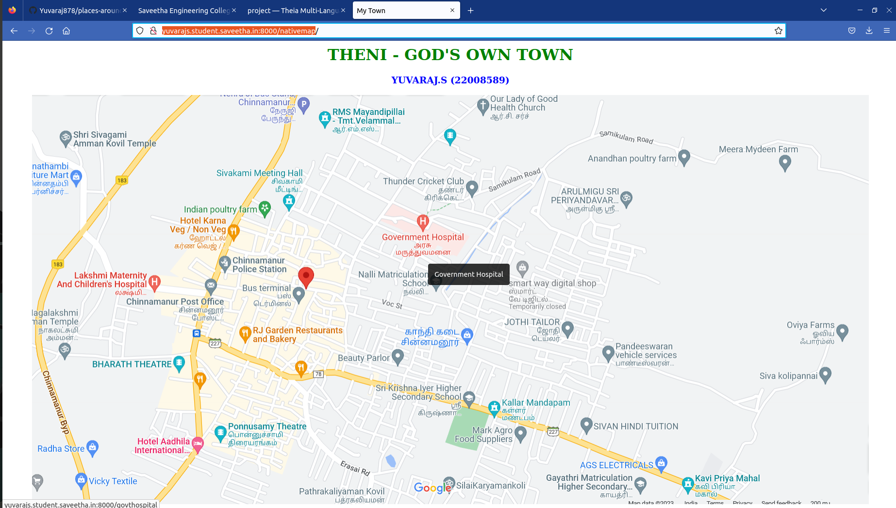
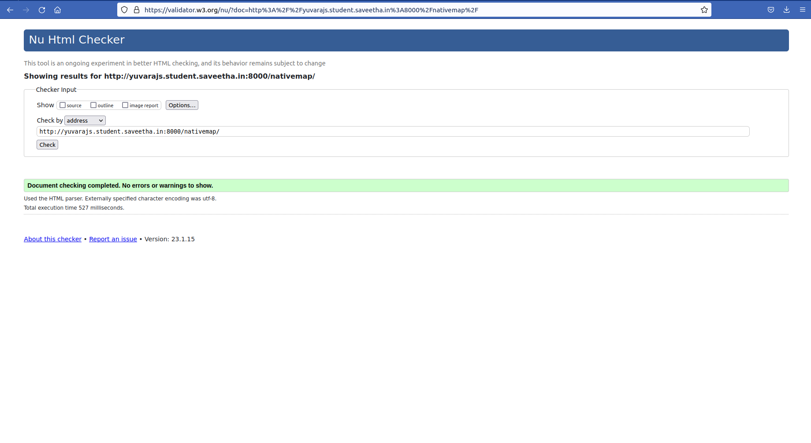
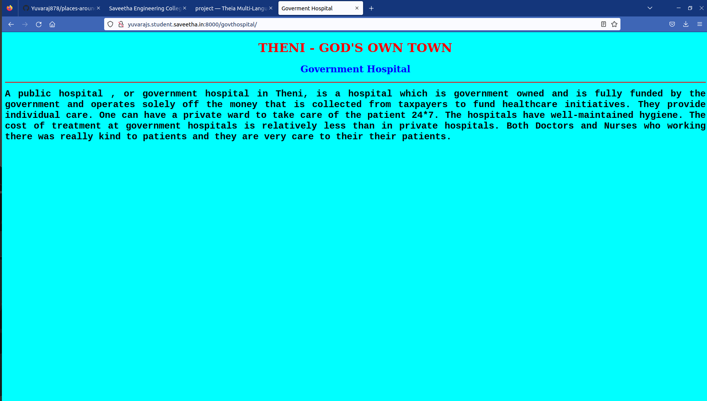
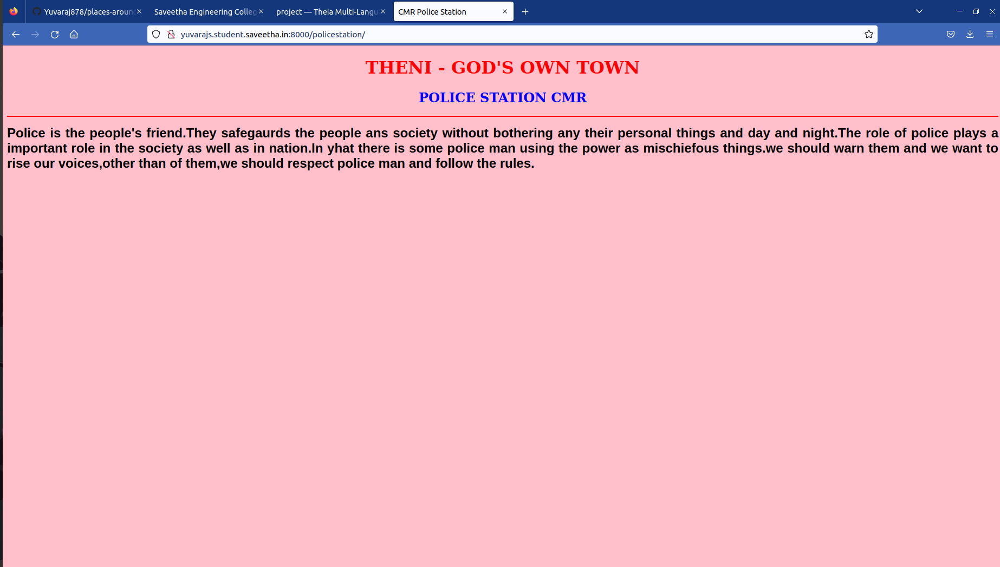
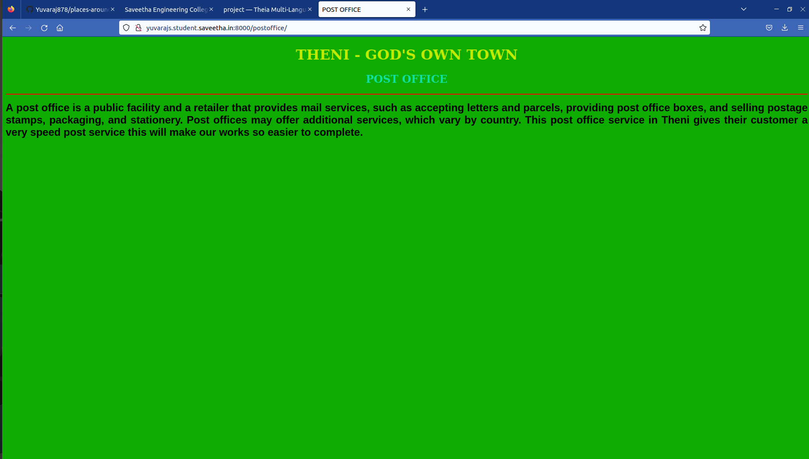
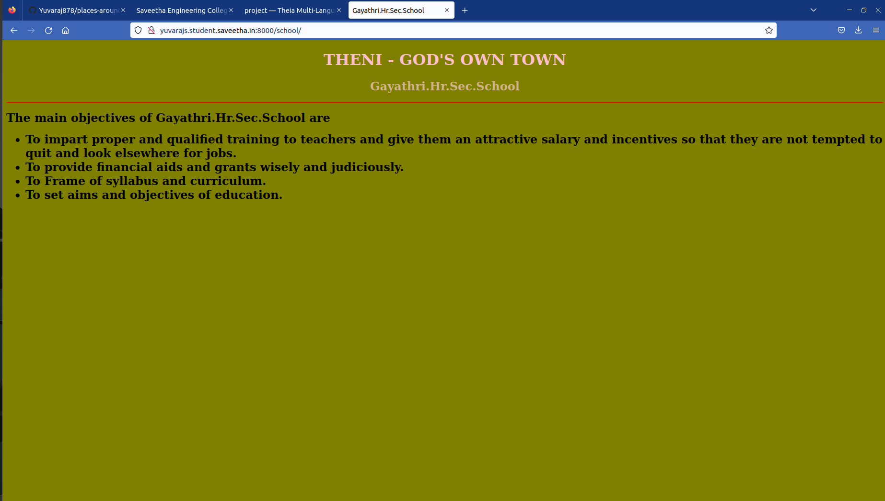
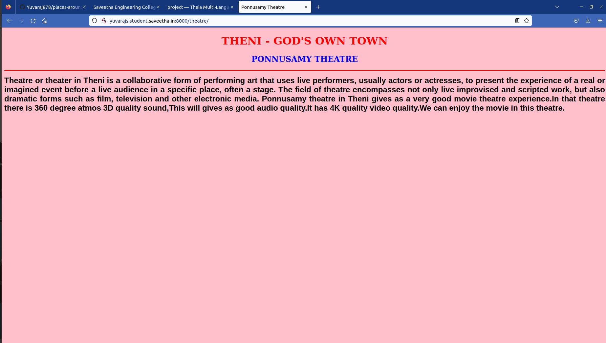

# Places Around Me
## AIM:
To develop a website to display details about the places around my house.

## Design Steps:

### Step 1:
First we want fork and clone the repository,then we want to create a project and app
using django framework. 
### Step 2:
In app we want to create the templates folder follows with app folder in that app folder 
we want to create a required html files.
### Step 3:
Then we want to take a screenshot of your map image and save it in a project folder follows with
static folder and then image.
### Step 4:
Then we want to write a revalent code in that html file
### Step 5:
Then we want to run the server.
### Code:
## Native map Code:
```
<!DOCTYPE html>
<html lang="en">
<head>
<title>My Town</title>
<style>
    h1{
        color:green;
        text-align: center;
}
    h2{
        color:blue;
        text-align: center;
    }
</style>
</head>
<body>
<h1><b>THENI - GOD'S OWN TOWN</b></h1>
<h2><b>YUVARAJ.S (22008589)</b></h2>

<map name="Map">
    <area alt="Government Hospital" title="Government Hospital" href="/govthospital" coords="713,247,898,338" shape="rect">
    <area alt="Threatre" title="Threatre" href="/theatre" coords="369,657,580,740" shape="rect">
    <area alt="Post Office" title="Post Office" href="/postoffice" coords="197,336,394,390" shape="rect">
    <area alt="Police Station" title="Police Station" href="/policestation/" coords="373,325,537,371" shape="rect">
    <area alt="Gayathri.Hr.Sec.School" title="Gayathri.Hr.Sec.School" href="/school" coords="1047,775,1279,833" shape="rect">
</map>
</body>
</html>

```
### Govthospital Code:
```
<!DOCTYPE html>
<html lang="en">
<head>
<title>Goverment Hospital</title>
</head>
<body bgcolor="cyan">
<h1 align="center">
<font color="red"><b>THENI - GOD'S OWN TOWN</b></font>
</h1>
<h3 align="center">
<font color="blue" size=5 ><b>Government Hospital</b></font>
</h3>
<hr size="3" color="red">
<p align="justify">
<font face="Courier New" size="5">
<b>
A public hospital , or government hospital in Theni, is a hospital which is government owned and is fully funded by the government 
and operates solely off the money that is collected from taxpayers to fund healthcare initiatives.
They provide individual care. One can have a private ward to take care of the patient 24*7. The hospitals have well-maintained hygiene.
The cost of treatment at government hospitals is relatively less than in private hospitals.
Both Doctors and Nurses who working there was really kind to patients and they are very care to their their patients.
</b>
</font>
</p>
</body>
</html>
```
### Policestation Code:
```
<!DOCTYPE html>
<html lang="en">
<head>
<title>CMR Police Station</title>
</head>
<body bgcolor="pink">
<h1 align="center">
<font color="red"><b>THENI - GOD'S OWN TOWN</b></font>
</h1>
<h3 align="center">
<font color="blue" size=5 ><b>POLICE STATION CMR</b></font>
</h3>
<hr size="3" color="red">
<p align="justify">
<font face="Arial" size="5">
<b>
Police is the people's friend.They safegaurds the people ans society without bothering any their personal things and day and 
night.The role of police plays a important role in the society as well as in nation.In yhat there is some police man using the 
power as mischiefous things.we should warn them and we want to rise our voices,other than of them,we should respect police man and
follow the rules.
</b>
</font>
</p>
</body>
</html>
```
### Postoffice Code:
```
<!DOCTYPE html>
<html lang="en">
<head>
<title>POST OFFICE</title>
</head>
<body bgcolor="peach">
<h1 align="center">
<font color="cream"><b>THENI - GOD'S OWN TOWN</b></font>
</h1>
<h3 align="center">
<font color="megenta" size=5 ><b>POST OFFICE</b></font>
</h3>
<hr size="3" color="red">
<p align="justify">
<font face="Arial" size="5">
<b>
A post office is a public facility and a retailer that provides mail services, such as accepting letters and parcels, providing post office boxes, and selling postage stamps, packaging, and stationery. 
Post offices may offer additional services, which vary by country.
This post office service in Theni gives their customer a very speed post service this will make our works so
easier to complete.
</b>
</font>
</p>
</body>
</html>
```
### School Code:
```
<!DOCTYPE html>
<html lang="en">
<head>
<title>Gayathri.Hr.Sec.School</title>
</head>
<body bgcolor="olive">
<h1 align="center">
<font color="pink"><b>THENI - GOD'S OWN TOWN</b></font>
</h1>
<h3 align="center">
<font color="tan" size=5 ><b>Gayathri.Hr.Sec.School</b></font>
</h3>
<hr size="3" color="red">
<p align="justify">
<font face="Georgia" size="5">
<b> 
The main objectives of Gayathri.Hr.Sec.School are 
<ul>
<li>To impart proper and qualified training to teachers and give them an attractive salary and incentives so that they are not tempted to quit and look elsewhere for jobs.</li>
<li>To provide financial aids and grants wisely and judiciously.</li>
<li>To Frame of syllabus and curriculum.</li>
<li>To set aims and objectives of education.</li>
</ul>
</b>   
</font>
</p>
</body>
</html>
```
### Theatre Code:
```
<!DOCTYPE html>
<html lang="en">
<head>
<title>Ponnusamy Theatre</title>
</head>
<body bgcolor="pink">
<h1 align="center">
<font color="red"><b>THENI - GOD'S OWN TOWN</b></font>
</h1>
<h3 align="center">
<font color="blue" size=5 ><b>PONNUSAMY THEATRE</b></font>
</h3>
<hr size="3" color="red">
<p align="justify">
<font face="Arial" size="5">
<b>
Theatre or theater in Theni is a collaborative form of performing art that uses live performers, usually actors or 
actresses, to present the experience of a real or imagined event before a live audience in a specific place, often a stage.
The field of theatre encompasses not only live improvised and scripted work, but 
also dramatic forms such as film, television and other electronic media.

Ponnusamy theatre in Theni gives as a very good movie theatre experience.In that theatre there is 360 degree
atmos 3D quality sound,This will gives as good audio quality.It has 4K quality video quality.We can enjoy the movie
in this theatre.
</b>
</font>
</p>
</body>
</html>
```
## Output:
### Native Map

### Native map Validator

### Govthospital

### Policestation

### Postoffice

### School

### Theatre


## Result:
The output for the places around me got successfull.